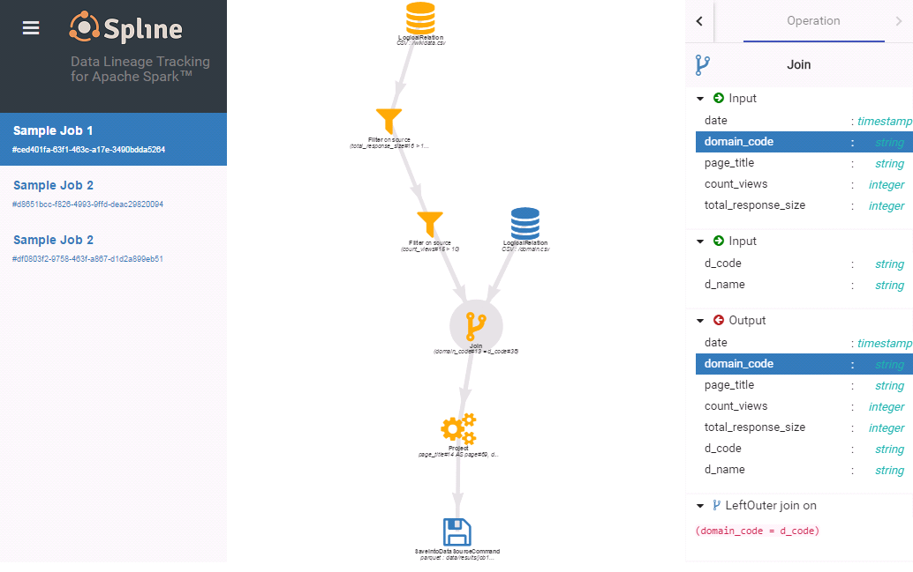

The **Spline** (from **Sp**ark **line**age) project helps people get a further insight into the data processing performed by [Apache Spark](http://spark.apache.org/).

[](https://teamcity.jetbrains.com/viewType.html?buildTypeId=OpenSourceProjects_AbsaOSSSpline_AutomaticBuildsWithTests_Spark24&branch=develop&tab=buildTypeStatusDiv)
[](https://app.codacy.com/app/ABSA_OSS/spline?utm_source=github.com&utm_medium=referral&utm_content=AbsaOSS/spline&utm_campaign=Badge_Grade_Dashboard)
[](https://maven-badges.herokuapp.com/maven-central/za.co.absa.spline/spline-core)

The project consists of two parts:
- A core library that sits on drivers, capturing the data lineage from Spark jobs being executed by analyzing the execution plans
- A Web UI application that visualizes the stored data lineages

***

[Spline paper](https://github.com/AbsaOSS/spline/releases/download/release%2F0.2.7/Spline_paper_IEEE_2018.pdf)

# Summary

### in your POM file:
```xml
<dependency>
    <groupId>za.co.absa.spline</groupId>
    <artifactId>spline-core</artifactId>
    <version>{{page.version}}</version>
</dependency>
<dependency>
    <groupId>za.co.absa.spline</groupId>
    <artifactId>spline-core-spark-adapter-2.2</artifactId>
    <!-- For compatibility with Spark 2.3 change above to spline-core-spark-adapter-2.3. -->
    <version>{{page.version}}</version>
</dependency>
<dependency>
    <groupId>za.co.absa.spline</groupId>
    <artifactId>spline-persistence-mongo</artifactId>
    <!-- You can use other types of persistence including your own. -->
    <!-- See below for details. -->
    <version>{{page.version}}</version>
</dependency>
```

### in your Spark job:
```scala
// given a Spark session ...
val sparkSession: SparkSession = ???

// ... enable data lineage tracking with Spline
import za.co.absa.spline.core.SparkLineageInitializer._
sparkSession.enableLineageTracking()

// ... then run some Dataset computations as usual.
// Data lineage of the job will be captured and stored in the
// configured Mongo database for further visualization by Spline Web UI
```

### download [Spline Web UI executable JAR](https://search.maven.org/remotecontent?filepath=za/co/absa/spline/spline-web/{{page.version}}/spline-web-{{page.version}}-exec-war.jar) and run:
```shell
java -jar spline-web-{{page.version}}-exec-war.jar -Dspline.mongodb.url=...
```

### in your browser open [localhost:8080](http://localhost:8080) and you will get:
<a href="imgs/screenshot.png"></a>


# Motivation
Spline aims to fill a big gap within the [Apache Hadoop](http://hadoop.apache.org/) ecosystem.
Spark jobs shouldn't be treated only as magic black boxes; people should be able to understand what happens with their data.
Our main focus is to solve the following particular problems:

* **Regulatory requirement for SA banks (BCBS 239)**

    By 2020, all South African banks will have to be able to prove how numbers are calculated in their reports to the regulatory authority.

* **Documentation of business logic**

    Business analysts should get a chance to verify whether Spark jobs were written according to the rules they provided.
    Moreover, it would be beneficial for them to have up-to-date documentation where they can refresh their knowledge of a project.

* **Identification of performance bottlenecks**

    Our focus is not only business-oriented; we also see Spline as a development tool that should be able to help developers
    with the performance optimization of their Spark jobs.

# Getting started

### Usage

Spline is available for use in a number of configurations;
within your code or entirely codeless, prebundled by us for ease of use or to be bundled for fine grained dependency management.

##### Dependencies

* [Scala](https://www.scala-lang.org/) 2.11
* [Spark](http://spark.apache.org/) 2.2.0
* [MongoDB](https://www.mongodb.com/) 3.4 (required for Spline Web UI)

## Project Integration Options

### Code based

#### Scala

```scala
// given a Spark session ...
val sparkSession: SparkSession = ???

// ... enable data lineage tracking with Spline
import za.co.absa.spline.core.SparkLineageInitializer._
sparkSession.enableLineageTracking()

 session.read() ...
```

#### Java

```java
import za.co.absa.spline.core.SparkLineageInitializer;
// given a Spark session ...
SparkSession session = ???

// configure Spline to track lineage
SparkLineageInitializer.enableLineageTracking(session);
session.read() ...
```

#### Python

```python

# Build project Sample with Shade profile to create Fat-JAR containing all needed dependencies:
  mvn package -P spark-2.3,shade

# Execute pyspark with Fat-JAR on class path:
  pyspark --jars 'target/spline-sample-{{page.version}}-SNAPSHOT.jar'

# Enable Spline tracking, Inside PySpark :
sc._jvm.za.co.absa.spline.core\
    .SparkLineageInitializer.enableLineageTracking(spark._jsparkSession)

spark.read\ ...

```

#### Codeless

```scala
object CodelessSparkJob extends SparkApp(
  name = "Codeless Job name",
  // Spark configuration used to register Spline listener for codeless init.
  conf = Seq(("spark.sql.queryExecutionListeners", "za.co.absa.spline.core.listener.QueryExecutionEventHandler"))
  ){
  // A business logic of a spark job ...
  spark.read ...

  }
  ```

### Bundle Based Integration

Use these dependencies in your POM file. <br />
&#9888; Manage your own exclusions

```xml
<dependency>
    <groupId>za.co.absa.spline</groupId>
    <artifactId>spline-core</artifactId>
    <version>{{page.version}}</version>
</dependency>
<dependency>
    <groupId>za.co.absa.spline</groupId>
    <artifactId>spline-core-spark-adapter-2.2</artifactId>
    <!-- For compatibility with Spark 2.3 change above to spline-core-spark-adapter-2.3. -->
    <version>{{page.version}}</version>
</dependency>
<dependency>
    <groupId>za.co.absa.spline</groupId>
    <artifactId>spline-persistence-mongo</artifactId>
    <!-- You can use other types of persistence including your own. -->
    <!-- See below for details. -->
    <version>{{page.version}}</version>
</dependency>
```


### Pre-bundled by Us 

According to the version of spark you are using you can find our different bundles here : [Bundles](https://search.maven.org/search?q=spline-bundle)

```xml
<dependency>
  <groupId>za.co.absa.spline</groupId>
  <artifactId>spline-bundle-{spark_version}</artifactId>
  <version>{{page.version}}</version>
</dependency>
```


#### Use maven dependency


##### Setup for your Spark job:

1. Include the Spline core jar into your Spark job classpath (it's enough to have it in a driver only, executors don't need it)

1. Configure database connection properties (see [Configuration](#configuration) section)

1. Enable data lineage tracking on a Spark session before calling any action method:
    ```scala
    import za.co.absa.spline.core.SparkLineageInitializer._
    sparkSession.enableLineageTracking()
    ```

##### Web UI application:

There are two ways to run the Spline Web UI:

###### Standalone application (executable JAR)

Execute: <br>
```java -jar spline-web-{{page.version}}-exec-war.jar -Dspline.mongodb.url=...```
and then point your browser to [http://localhost:8080](http://localhost:8080).

To change the port number from *8080* to say *1234* add ```-httpPort 1234``` to the command line.

(For more details see the section[Generated executable jar/war](http://tomcat.apache.org/maven-plugin-trunk/executable-war-jar.html#Generated_executable_jarwar).)

###### Standard Java web application (WAR)

1. In your Java web container, e.g. Tomcat, set up the Spline database connection properties
either via system environment variables or JVM system properties in the following format:
    ```properties
    spline.mongodb.url=mongodb://11.22.33.44/my_lineage_database_name
    ```

1. Deploy the Spline WAR file to your Java web container (tested on Tomcat 7, but other containers should also work)


### Build Spline from the source code
You will need:
* [JDK](http://www.oracle.com/technetwork/java/javase/downloads/jdk8-downloads-2133151.html) 8+
* [Maven](https://maven.apache.org) 3.0
* [Node.js](https://nodejs.org/) 6.9

```
mvn install -DskipTests -Pspark-2.3
```

# <a name="persistence"></a> Lineage persistence
Spline can persist harvested lineages in various ways. It uses [PersistenceFactory]({{ site.github.repository_url }}/blob/master/persistence/api/src/main/scala/za/co/absa/spline/persistence/api/PersistenceFactory.scala) to obtain instances of [DataLineageReader]({{ site.github.repository_url }}/blob/master/persistence/api/src/main/scala/za/co/absa/spline/persistence/api/DataLineageReader.scala) and [DataLineageWriter]({{ site.github.repository_url }}/blob/master/persistence/api/src/main/scala/za/co/absa/spline/persistence/api/DataLineageWriter.scala) to persist and access the data lineages.
Out of the box Spline supports three types of persisters:
- [MongoPersistenceFactory]({{ site.github.repository_url }}/blob/master/persistence/mongo/src/main/scala/za/co/absa/spline/persistence/mongo/MongoPersistenceFactory.scala) (stores lineages to the MongoDB)
- [HdfsPersistenceFactory]({{ site.github.repository_url }}/blob/master/persistence/hdfs/src/main/scala/za/co/absa/spline/persistence/hdfs/HdfsPersistenceFactory.scala) (stores lineages as a JSON file)

There is also a [ParallelCompositeFactory]({{ site.github.repository_url }}/blob/master/persistence/api/src/main/scala/za/co/absa/spline/persistence/api/composition/ParallelCompositeFactory.scala) that works as a proxy and delegates work to other persisters.
You can store the lineages to multiple sources simultaneously, e.g. Mongo and HDFS.


# <a name="configuration"></a> Configuration
When enabling data lineage tracking for a Spark session in your Spark job, a ```SparkConfigurer``` instance can be passed
as a argument to the ```enableLineageTracking()``` method.

The method signature is as follows:
```scala
def enableLineageTracking(configurer: SplineConfigurer = new DefaultSplineConfigurer(defaultSplineConfiguration)): SparkSession
```

```DefaultSplineConfigurer``` looks up the configuration parameters in the given ```Configuration``` object.

```defaultSplineConfiguration``` object combines several configuration sources (ordered by priority):
1. Hadoop config (```core-site.xml```)
1. JVM system properties
1. ```spline.properties``` file in the classpath

### Configuration properties

#### Shared

| Property | Description | Example
| --- | --- | --- |
| `spline.mode` | __DISABLED__<br>Lineage tracking is completely disabled and Spline is unhooked from Spark.<br><br>__REQUIRED__<br>If Spline fails to initialize itself (e.g. wrong configuration, no db connection etc) the Spark application aborts with an error.<br><br>**BEST_EFFORT** (default)<br>Spline will try to initialize itself, but if fails it switches to _DISABLED_ mode allowing the Spark application to proceed normally without Lineage tracking. | BEST_EFFORT |
| `spline.persistence.factory` | Fully qualified name of the [PersistenceFactory]({{ site.github.repository_url }}/blob/master/persistence/api/src/main/scala/za/co/absa/spline/persistence/api/PersistenceFactory.scala) implementation to use by Spline | za.co.absa.spline.persistence.mongo.MongoPersistenceFactory

#### Mongo Persistence Only

| Property | Description | Example
| --- | --- | --- |
| `spline.mongodb.url` | Mongo connection URL <br> | mongodb://1.2.3.4/my_lineage_database

#### Composition Factories Only

| Property | Description | Example
| --- | --- | --- |
| `spline.persistence.composition.factories` | Comma separated list of factories to delegate to <br> | za.co.absa.spline.persistence.mongo.MongoPersistenceFactory, za.co.absa.spline.persistence.hdfs.HdfsPersistenceFactory

#### Optional: Async Timeout
Depending on your persistence setup and requirements you can consider increasing the HTTP request timeout to avoid premature failures (`AsyncRequestTimeoutException`). You can increase Tomcat's global `asyncTimeout` property in `conf/servers.xml` from default 30 seconds to desired value e.g. to 60 seconds as in example below.
```
<Connector port="8080" protocol="HTTP/1.1" asyncTimeout="60000" ... />
```


# Examples
The [sample]({{ site.github.repository_url }}/tree/master/sample/) folder contains some sample Spline enabled Spark jobs.

Sample jobs read data from the [/sample/data/input/]({{ site.github.repository_url }}/tree/master/sample/data/input/) folder
and write the result into [/sample/data/results/]({{ site.github.repository_url }}/tree/master/sample/data/results/)

When the lineage data is captured and stored into the database, it can be visualized and explored via the Spline UI Web application.

##### Sample job 1

```scala
val sparkBuilder = SparkSession.builder().appName("Sample Job 2")
val spark = sparkBuilder.getOrCreate()

// Enable data lineage tracking with Spline
import za.co.absa.spline.core.SparkLineageInitializer._
spark.enableLineageTracking()

// A business logic of a Spark job ...
import spark.implicits._

val sourceDS = spark.read
  .option("header", "true")
  .option("inferSchema", "true")
  .csv("data/input/wikidata.csv")
  .as("source")
  .filter($"total_response_size" > 1000)
  .filter($"count_views" > 10)

val domainMappingDS = spark.read
  .option("header", "true")
  .option("inferSchema", "true")
  .csv("data/input/domain.csv")
  .as("mapping")

val joinedDS = sourceDS
  .join(domainMappingDS, $"domain_code" === $"d_code", "left_outer")
  .select($"page_title".as("page"), $"d_name".as("domain"), $"count_views")

joinedDS.write.mode(SaveMode.Overwrite).parquet("data/results/job1_results")
```

# Release Migration: MongoDb

Please follow the instructions in the readme file [here]({{ site.github.repository_url }}/tree/master/persistence/mongo/src/main/dbscripts) to migrate your MongoDB release from your current version to the desired version.

# Contribution

**TODO**

# License

    Copyright 2017 ABSA Group Limited

    Licensed under the Apache License, Version 2.0 (the "License");
    you may not use this file except in compliance with the License.
    You may obtain a copy of the License at

        http://www.apache.org/licenses/LICENSE-2.0

    Unless required by applicable law or agreed to in writing, software
    distributed under the License is distributed on an "AS IS" BASIS,
    WITHOUT WARRANTIES OR CONDITIONS OF ANY KIND, either express or implied.
    See the License for the specific language governing permissions and
    limitations under the License.
